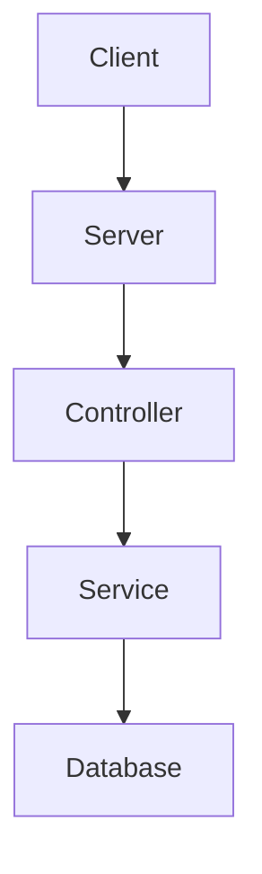
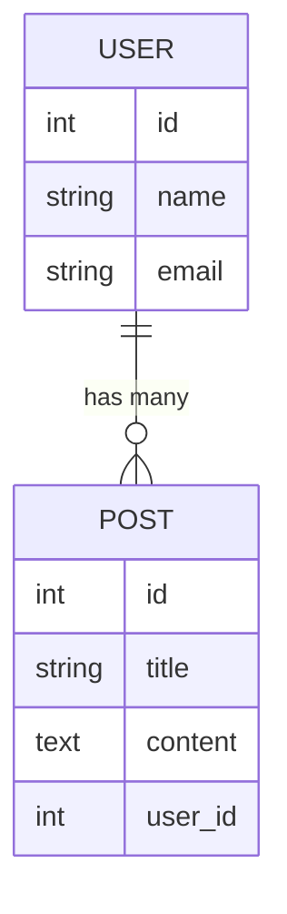

# Sample Node.js Application

This document provides an overview of a sample Node.js application. It includes architecture diagrams created using Mermaid and reference links for further reading.

## Architecture

### Application Flow



### Database Schema



## Getting Started

To get started with the sample Node.js application, follow these steps:

1. Clone the repository:
    ```sh
    git clone https://github.com/your-repo/sample-nodejs-app.git
    ```
2. Install dependencies:
    ```sh
    cd sample-nodejs-app
    npm install
    ```
3. Start the application:
    ```sh
    npm start
    ```

## Reference Links

- [Node.js Documentation](https://nodejs.org/en/docs/)
- [Express.js Documentation](https://expressjs.com/)
- [Mermaid Documentation](https://mermaid-js.github.io/mermaid/#/)
